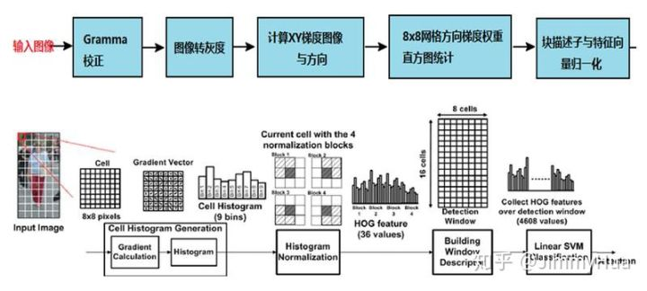

传统的对象检测与标注技术 HOG + SVM
===
> create by [afterloe](605728727@qq.com)  
> version is 1.0.0  
> MIT License

#### HOG特征描述子提取
HOG(Histogram of Oriented Gradient)特征在对象识别与模式匹配中是一种常见的特征提取算法，是基于本地像素块进行特征直方图提取的一种算法，对象局部的变形与光照影响有很好的稳定性。

#### HOG特征描述子提取过程

 
> 如图，HOG特征描述子的提取的整体过程

##### Gamma矫正  
Gamma矫正是为了提高好检测器对光照、机器干扰等噪声影响的因素的识别性，需要对图像进行Gamma矫正，完整的矫正过程为：
图像归一化，调整对比度 。

##### 灰度处理
将图像转化为灰度图像，可有效提升特征的描述信息。

##### 计算图像XY梯度与方向
使用`Sobel`算子计算梯度
```python
gx = cv.Sobel(image, cv.CV_32F, 1, 0, ksize=1)
gy = cv.Sobel(image, cv.CV_32F, 0, 1, ksize=1)
```
使用公式求取梯度的值和方向：
```python
mag, angle = cv.cartToPolar(gx, gy, angleInDegress=True)
```

##### 8*8网格方向梯度与权重直方图统计
默认HOG描述子窗口为`64 * 128`，窗口移动步长为`8 * 8`， 移动窗口为`4 * 4`， 直方图把180度分为9个bin，每个区间为20度，如果像素落在某个区间，
就把该像素的直方图累计到对应区间的直方图上。每个block有4个cell,每个cell有9个向量值，即每个block有36个向量，所以整个窗口有7x15x36=3780个特征描述子。

##### 块描述子和特征向量归一化
每个block可以得到4个9维的向量，需要再次进行一次归一化，这样可以进一步提高泛化能力

