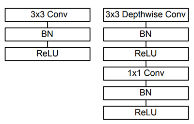

# Computer Version And Deep Learn

> create by [afterloe](605728727@qq.com)  
> version is 1.0.0  
> MIT License  

#### 常用的几种对象检测模型

* [Faster R-CNNs](https://arxiv.org/abs/1506.01497): 以ROI区域进行CNN模型训练后的对象检测模型， 该模型精确的很高，但是检测速度偏慢，平均7FPS
* [You Only Look Once](https://arxiv.org/abs/1506.02640): YOLO对象检测模型， 高速对象检测模型，平均FPS可达 40 - 90， 最高可到155FPS, 但该模型最大的缺点时识别的准确度不够
* [Single Shot Detectors](https://arxiv.org/abs/1512.02325):  Google的SSD模型时介于RCNNs与YOLO之间的，既保证了准确度又提升了识别的速度。SSD模型平均FPS可达22 - 46

> mobile net 深度神经网络

在构建对象检测网络时，通常使用的网络体系结构（例如VGG或ResNet），在对象检测使用时存在速度和移植问题。该问题在于这些网络体系结构可能非常大，通常约为200-500MB。
相反，可以使用MobileNets（Howard et al。，2017），这是Google研究人员的另一篇论文。
这些网络称为“ MobileNets”，它们是为资源受限的设备（例如智能手机、raspberry等）设计的。
通过使用深度可分离卷积，进行扫描， MobileNet与传统CNN有所不同（如上图）。    

mobile_net_ssd 模型由最初的[TensorFlow](https://github.com/Zehaos/MobileNet)进行训练， 详细内容可参考[GitHub](https://github.com/chuanqi305/MobileNet-SSD)
MobileNet SSD使用[COCO数据集（上下文中的公共对象）](http://cocodataset.org/)训练，平均准确率可达 72.7％

