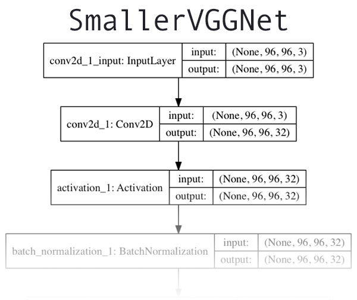

# CNNs Neural Networks

> create by [afterloe](605728727@qq.com)  
> version is 1.0.4  
> MIT License  

##### CNNs网络实践  
使用Keras和深度学习训练卷积神经网络，以识别和分类指定图像

> 图一： 所使用的模型示意图

总共分为四层，其特点是， 仅使用3×3卷积层，以越来越大的深度堆叠在一起并通过最大池化来减少卷大小。

##### 训练
```shell script
Using TensorFlow backend.
2020-03-24 22:48:02.663290: I tensorflow/stream_executor/platform/default/dso_loader.cc:44] Successfully opened dynamic library cudart64_101.dll
[Tue, 24 Mar 2020 22:48:06][train.py][INFO] - 模型训练工具 1.0.5
usage: train.py [-h] -d DATASET -m MODEL -l LABELBIN [-p PLOT]

optional arguments:
  -h, --help            show this help message and exit
  -d DATASET, --dataset DATASET
                        图像集路径
  -m MODEL, --model MODEL
                        模型输出路径
  -l LABELBIN, --labelbin LABELBIN
                        标签二进制文件输出路径
  -p PLOT, --plot PLOT  输出训练曲线

& 'D:\Program Files\Python37-64\python.exe' .\train.py -d .\resources\ -m pokedex.model -l lb.pickle
```

##### 日志
```shell script
PS G:\Project\py3\computer_version_demo\cnns_nerual> & 'D:\Program Files\Python37-64\python.exe' .\train.py -d .\resources\ -m .\resources\power.model -l .\resources\label.bin
Using TensorFlow backend.
2020-03-27 23:18:57.877897: I tensorflow/stream_executor/platform/default/dso_loader.cc:44] Successfully opened dynamic library cudart64_101.dll
[Fri, 27 Mar 2020 23:19:21][train.py][INFO] - 模型训练工具 1.0.5
[Fri, 27 Mar 2020 23:19:21][train.py][INFO] - 加载.\resources\图像, 并启动预处理
[Fri, 27 Mar 2020 23:19:34][train.py][INFO] - 数据矩阵: 220.10 Mb
[Fri, 27 Mar 2020 23:19:34][train.py][INFO] - 模型初始化
2020-03-27 23:19:34.555814: I tensorflow/stream_executor/platform/default/dso_loader.cc:44] Successfully opened dynamic library nvcuda.dll
2020-03-27 23:19:34.595315: I tensorflow/core/common_runtime/gpu/gpu_device.cc:1555] Found device 0 with properties:
pciBusID: 0000:01:00.0 name: GeForce GTX 960 computeCapability: 5.2
coreClock: 1.253GHz coreCount: 8 deviceMemorySize: 4.00GiB deviceMemoryBandwidth: 104.46GiB/s
2020-03-27 23:19:34.601871: I tensorflow/stream_executor/platform/default/dso_loader.cc:44] Successfully opened dynamic library cudart64_101.dll
2020-03-27 23:19:34.670878: I tensorflow/stream_executor/platform/default/dso_loader.cc:44] Successfully opened dynamic library cublas64_10.dll
2020-03-27 23:19:34.715770: I tensorflow/stream_executor/platform/default/dso_loader.cc:44] Successfully opened dynamic library cufft64_10.dll
2020-03-27 23:19:34.741070: I tensorflow/stream_executor/platform/default/dso_loader.cc:44] Successfully opened dynamic library curand64_10.dll
2020-03-27 23:19:34.797126: I tensorflow/stream_executor/platform/default/dso_loader.cc:44] Successfully opened dynamic library cusolver64_10.dll
2020-03-27 23:19:34.841651: I tensorflow/stream_executor/platform/default/dso_loader.cc:44] Successfully opened dynamic library cusparse64_10.dll
2020-03-27 23:19:35.079802: I tensorflow/stream_executor/platform/default/dso_loader.cc:44] Successfully opened dynamic library cudnn64_7.dll
2020-03-27 23:19:35.085560: I tensorflow/core/common_runtime/gpu/gpu_device.cc:1697] Adding visible gpu devices: 0
2020-03-27 23:19:35.090363: I tensorflow/core/platform/cpu_feature_guard.cc:142] Your CPU supports instructions that this TensorFlow binary was not compiled to use: AVX2
2020-03-27 23:19:35.096230: I tensorflow/core/common_runtime/gpu/gpu_device.cc:1555] Found device 0 with properties:
pciBusID: 0000:01:00.0 name: GeForce GTX 960 computeCapability: 5.2
coreClock: 1.253GHz coreCount: 8 deviceMemorySize: 4.00GiB deviceMemoryBandwidth: 104.46GiB/s
2020-03-27 23:19:35.104393: I tensorflow/stream_executor/platform/default/dso_loader.cc:44] Successfully opened dynamic library cudart64_101.dll
2020-03-27 23:19:35.107773: I tensorflow/stream_executor/platform/default/dso_loader.cc:44] Successfully opened dynamic library cublas64_10.dll
2020-03-27 23:19:35.112132: I tensorflow/stream_executor/platform/default/dso_loader.cc:44] Successfully opened dynamic library cufft64_10.dll
2020-03-27 23:19:35.114927: I tensorflow/stream_executor/platform/default/dso_loader.cc:44] Successfully opened dynamic library curand64_10.dll
2020-03-27 23:19:35.118014: I tensorflow/stream_executor/platform/default/dso_loader.cc:44] Successfully opened dynamic library cusolver64_10.dll
2020-03-27 23:19:35.121252: I tensorflow/stream_executor/platform/default/dso_loader.cc:44] Successfully opened dynamic library cusparse64_10.dll
2020-03-27 23:19:35.124331: I tensorflow/stream_executor/platform/default/dso_loader.cc:44] Successfully opened dynamic library cudnn64_7.dll
2020-03-27 23:19:35.129457: I tensorflow/core/common_runtime/gpu/gpu_device.cc:1697] Adding visible gpu devices: 0
2020-03-27 23:19:44.459655: I tensorflow/core/common_runtime/gpu/gpu_device.cc:1096] Device interconnect StreamExecutor with strength 1 edge matrix:
2020-03-27 23:19:44.465676: I tensorflow/core/common_runtime/gpu/gpu_device.cc:1102]      0
2020-03-27 23:19:44.467817: I tensorflow/core/common_runtime/gpu/gpu_device.cc:1115] 0:   N
2020-03-27 23:19:44.488641: I tensorflow/core/common_runtime/gpu/gpu_device.cc:1241] Created TensorFlow device (/job:localhost/replica:0/task:0/device:GPU:0 with 3020 MB memory) -> physical GPU (device: 0, name: GeForce GTX 960, pci bus id: 0000:01:00.0, compute capability: 5.2)
[Fri, 27 Mar 2020 23:19:45][train.py][INFO] - 启动训练
Epoch 1/100
2020-03-27 23:19:49.203057: I tensorflow/stream_executor/platform/default/dso_loader.cc:44] Successfully opened dynamic library cublas64_10.dll
2020-03-27 23:19:49.962239: I tensorflow/stream_executor/platform/default/dso_loader.cc:44] Successfully opened dynamic library cudnn64_7.dll
2020-03-27 23:19:53.923882: W tensorflow/stream_executor/gpu/redzone_allocator.cc:312] Internal: Invoking GPU asm compilation is supported on Cuda non-Windows platforms only
Relying on driver to perform ptx compilation. This message will be only logged once.
25/25 [==============================] - 11s 429ms/step - loss: 2.9107 - accuracy: 0.2656 - val_loss: 2.3034 - val_accuracy: 0.1667
Epoch 2/100
25/25 [==============================] - 3s 103ms/step - loss: 2.0041 - accuracy: 0.3819 - val_loss: 2.6532 - val_accuracy: 0.0637
Epoch 3/100
```

##### 图像预测
```shell script
PS G:\Project\py3\computer_version_demo\cnns_nerual> & 'D:\Program Files\Python37-64\python.exe' .\classify.py -m .\resources\power.model -l .\resources\label.bin -i G:\3.png
Using TensorFlow backend.
2020-03-27 23:33:43.670353: I tensorflow/stream_executor/platform/default/dso_loader.cc:44] Successfully opened dynamic library cudart64_101.dll
[Fri, 27 Mar 2020 23:33:46][classify.py][INFO] - 分类工具 1.0.0
[Fri, 27 Mar 2020 23:33:46][classify.py][INFO] - 加载模型
2020-03-27 23:33:46.465622: I tensorflow/stream_executor/platform/default/dso_loader.cc:44] Successfully opened dynamic library nvcuda.dll
2020-03-27 23:33:46.489787: I tensorflow/core/common_runtime/gpu/gpu_device.cc:1555] Found device 0 with properties:
pciBusID: 0000:01:00.0 name: GeForce GTX 960 computeCapability: 5.2
coreClock: 1.253GHz coreCount: 8 deviceMemorySize: 4.00GiB deviceMemoryBandwidth: 104.46GiB/s
2020-03-27 23:33:46.499278: I tensorflow/stream_executor/platform/default/dso_loader.cc:44] Successfully opened dynamic library cudart64_101.dll
2020-03-27 23:33:46.509508: I tensorflow/stream_executor/platform/default/dso_loader.cc:44] Successfully opened dynamic library cublas64_10.dll
2020-03-27 23:33:46.518816: I tensorflow/stream_executor/platform/default/dso_loader.cc:44] Successfully opened dynamic library cufft64_10.dll
2020-03-27 23:33:46.524877: I tensorflow/stream_executor/platform/default/dso_loader.cc:44] Successfully opened dynamic library curand64_10.dll
2020-03-27 23:33:46.534717: I tensorflow/stream_executor/platform/default/dso_loader.cc:44] Successfully opened dynamic library cusolver64_10.dll
2020-03-27 23:33:46.544580: I tensorflow/stream_executor/platform/default/dso_loader.cc:44] Successfully opened dynamic library cusparse64_10.dll
2020-03-27 23:33:46.565077: I tensorflow/stream_executor/platform/default/dso_loader.cc:44] Successfully opened dynamic library cudnn64_7.dll
2020-03-27 23:33:46.570131: I tensorflow/core/common_runtime/gpu/gpu_device.cc:1697] Adding visible gpu devices: 0
2020-03-27 23:33:46.572978: I tensorflow/core/platform/cpu_feature_guard.cc:142] Your CPU supports instructions that this TensorFlow binary was not compiled to use: AVX2
2020-03-27 23:33:46.580584: I tensorflow/core/common_runtime/gpu/gpu_device.cc:1555] Found device 0 with properties:
pciBusID: 0000:01:00.0 name: GeForce GTX 960 computeCapability: 5.2
coreClock: 1.253GHz coreCount: 8 deviceMemorySize: 4.00GiB deviceMemoryBandwidth: 104.46GiB/s
2020-03-27 23:33:46.588939: I tensorflow/stream_executor/platform/default/dso_loader.cc:44] Successfully opened dynamic library cudart64_101.dll
2020-03-27 23:33:46.592550: I tensorflow/stream_executor/platform/default/dso_loader.cc:44] Successfully opened dynamic library cublas64_10.dll
2020-03-27 23:33:46.597525: I tensorflow/stream_executor/platform/default/dso_loader.cc:44] Successfully opened dynamic library cufft64_10.dll
2020-03-27 23:33:46.602314: I tensorflow/stream_executor/platform/default/dso_loader.cc:44] Successfully opened dynamic library curand64_10.dll
2020-03-27 23:33:46.607320: I tensorflow/stream_executor/platform/default/dso_loader.cc:44] Successfully opened dynamic library cusolver64_10.dll
2020-03-27 23:33:46.611931: I tensorflow/stream_executor/platform/default/dso_loader.cc:44] Successfully opened dynamic library cusparse64_10.dll
2020-03-27 23:33:46.616453: I tensorflow/stream_executor/platform/default/dso_loader.cc:44] Successfully opened dynamic library cudnn64_7.dll
2020-03-27 23:33:46.621145: I tensorflow/core/common_runtime/gpu/gpu_device.cc:1697] Adding visible gpu devices: 0
2020-03-27 23:33:47.119284: I tensorflow/core/common_runtime/gpu/gpu_device.cc:1096] Device interconnect StreamExecutor with strength 1 edge matrix:
2020-03-27 23:33:47.124861: I tensorflow/core/common_runtime/gpu/gpu_device.cc:1102]      0
2020-03-27 23:33:47.127681: I tensorflow/core/common_runtime/gpu/gpu_device.cc:1115] 0:   N
2020-03-27 23:33:47.132851: I tensorflow/core/common_runtime/gpu/gpu_device.cc:1241] Created TensorFlow device (/job:localhost/replica:0/task:0/device:GPU:0 with 3020 MB memory) -> physical GPU (device: 0, name: GeForce GTX 960, pci bus id: 0000:01:00.0, compute capability: 5.2)
[Fri, 27 Mar 2020 23:33:50][classify.py][INFO] - 图像分类预测
2020-03-27 23:33:50.295366: I tensorflow/stream_executor/platform/default/dso_loader.cc:44] Successfully opened dynamic library cublas64_10.dll
2020-03-27 23:33:50.488598: I tensorflow/stream_executor/platform/default/dso_loader.cc:44] Successfully opened dynamic library cudnn64_7.dll
2020-03-27 23:33:51.103049: W tensorflow/stream_executor/gpu/redzone_allocator.cc:312] Internal: Invoking GPU asm compilation is supported on Cuda non-Windows platforms only
Relying on driver to perform ptx compilation. This message will be only logged once.
[Fri, 27 Mar 2020 23:33:51][classify.py][INFO] - 阿尔法兽
[Fri, 27 Mar 2020 23:33:51][classify.py][INFO] - 5: 100.00% (incorrect)
```