MiNiFi与NiFi的尝试指南
===
> create by [afterloe](605728727@qq.com)  
> version is 1.1  
> MIT License  

最近一段时间在做IIOT的实践，计划使用MiNiFi与NiFi进行实践，IIOT的架构如下：  
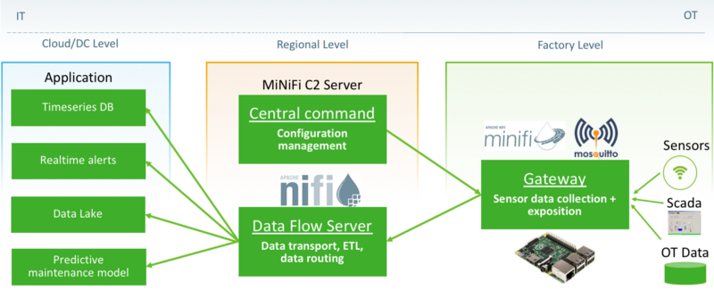  

使用树莓派作为地层终端进行数据采集，并上传上到上层的NiFi，在由NiFi进行数据分流

#### 相关软件下载
* [NiFi](https://nifi.apache.org/download.html) 版本`1.10.0`
* [MiNiFi](https://nifi.apache.org/minifi/download.html) 版本`0.4.0`
* [MiNiFi toolkit](https://www.apache.org/dyn/closer.lua?path=/nifi/minifi/0.0.1/minifi-toolkit-0.0.1-bin.tar.gz) 版本`0.0.1`
* [FastAPI](https://github.com/tiangolo/fastapi)
* [MiNiFi c2](https://archive.apache.org/dist/nifi/minifi/0.4.0/minifi-c2-0.4.0-bin.tar.gz) 版本`0.4.0`

> PS: 软件版本一定要一致， 尤其是 MiNiFi 与 MiNiFi C2, 最新版不建议用；另外，由于终端使用的是raspberry，为ARM架构，所以使用Java版本

#### 调试指南

#### 材料准备
x86服务器（Ubuntu 18.04）、ARM开发版(raspberrypi 4.19.97) ， IP列表如下
```shell script
192.168.200.2   king
192.168.200.25  raspberry-pi
```

#### 服务器端
下载NiFi（1.10.0）版本、MiNiFi C2（0.4.0）版本与Java（1.8+）并进行简单配置
```shell script
cd /usr/local/apps
wget https://repo.huaweicloud.com/java/jdk/8u151-b12/jdk-8u151-linux-x64.tar.gz
wget https://archive.apache.org/dist/nifi/1.10.0/nifi-1.10.0-bin.tar.gz
wget http://apache.crihan.fr/dist/nifi/minifi/0.4.0/minifi-c2-0.4.0-bin.tar.gz
tar -xzvf jdk-8u151-linux-x64.tar.gz
tar -xzvf nifi-1.10.0-bin.tar.gz
tar -xzvf minifi-c2-0.4.0-bin.tar.gz
```

配置Java环境
```shell script
vim ~/.profile

export JAVA_HOME=/usr/local/apps/jdk1.8.0_151
export PATH=$JAVA_HOME/bin:$PATH

source ~/.profile
java -version

java version "1.8.0_151"
Java(TM) SE Runtime Environment (build 1.8.0_151-b12)
Java HotSpot(TM) 64-Bit Server VM (build 25.151-b12, mixed mode)
```

（可选）配置C2服务器
```shell script
cd /usr/local/apps/minifi-c2-0.4.0
vim conf/minifi-c2-context.xml

# 去除注释，留以下内容
<beanclass="org.apache.nifi.minifi.c2.provider.nifi.rest.NiFiRestConfigurationProvider">

# 修改NiFi地址
<constructor-arg><value>http://192.168.200.2:8080/nifi-api</value></constructor-arg>
```
> C2服务用于动态修改minifi的采集流程

配置NiFi
```shell script
cd /usr/local/apps/nifi-1.10.0
vim conf/nifi.properties

# Site to Site properties
nifi.remote.input.host=king
nifi.remote.input.secure=false
nifi.remote.input.socket.port=10260
nifi.remote.input.http.enabled=true
nifi.remote.input.http.transaction.ttl=30 sec
# web properties #
nifi.web.war.directory=./lib
nifi.web.http.host=0.0.0.0                                                                           
nifi.web.http.port=8080

bin/nifi.sh start
Java home: /usr/local/apps/jdk1.8.0_151
NiFi home: /usr/local/apps/nifi-1.10.0

Bootstrap Config File: /usr/local/apps/nifi-1.10.0/conf/bootstrap.conf
```

查看端口占用情况
```shell script
netstat -lntp
tcp        0      0 0.0.0.0:10260           0.0.0.0:*               LISTEN      33944/java          
tcp        0      0 0.0.0.0:8080            0.0.0.0:*               LISTEN      33944/java
```
访问 `http://king:8080/nifi` 出现以下界面，表示nifi安装成功  
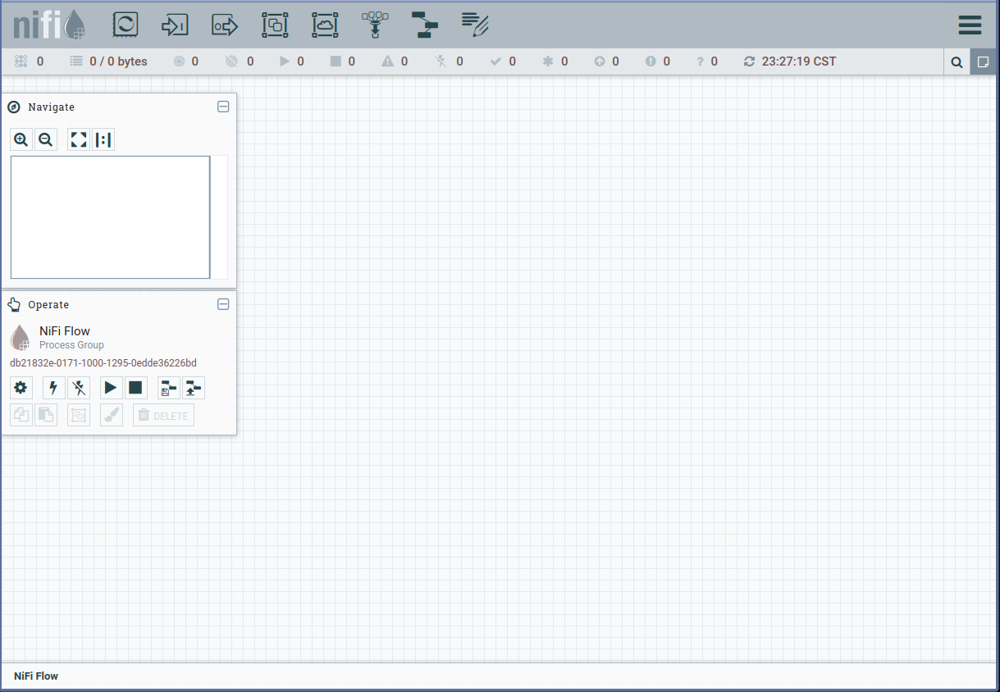

#### 数据流设计
在 `http://king:8080/nifi` 页面进行数据流设计，该步骤分两步，即服务端数据流（NiFi）流程与客户端数据流设计（MiNiFi）两部分

##### 服务端数据流设计（即获取到终端上传数据后的服务器处理流程）
拖入一个`Input Port`, 取名为`From Raspberry Agent`    
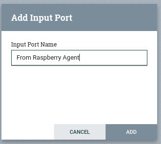  
再拖入一个`Processor`，搜索`logattribute`，点击`add`添加  
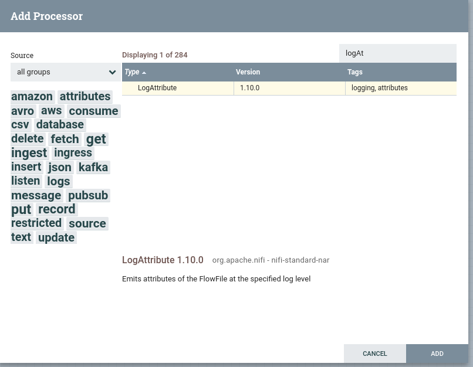  
拖入完成后如下图  
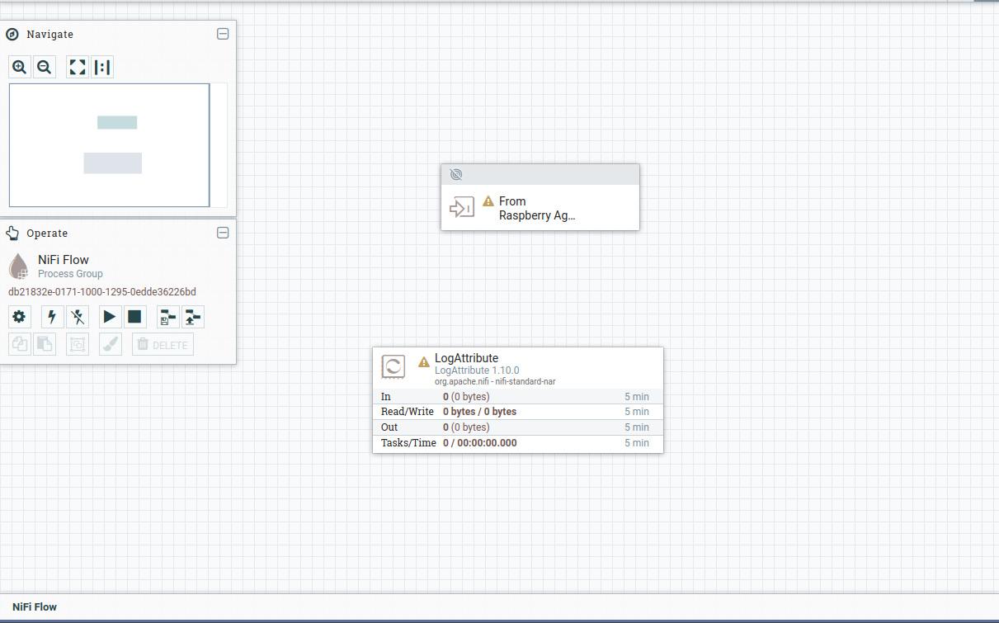  
通过两个组建之间的箭头进行连接，如下图  
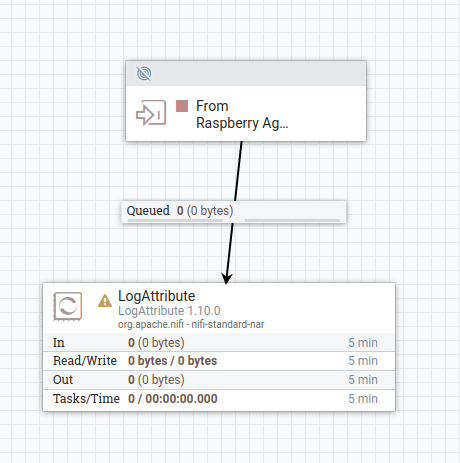  
可以看到，组件`LogAttribute`有个黄色的箭头，此时流程执行是会存在异常的，双击该组件进行配置，配置后的内容如下图所示：  
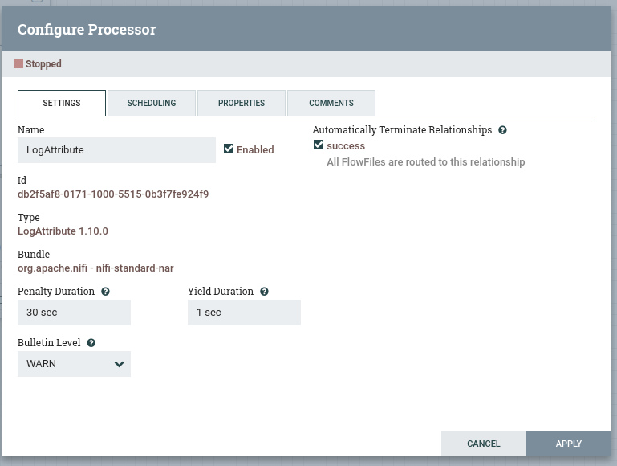  

##### 客户端数据流设计
由于MiNiFi没有对应的流程设计器，所以使用NiFi的web流程设计器。  
在旁边拖入`Processor`，搜索`tailFile`，并双击该组件进行配置  
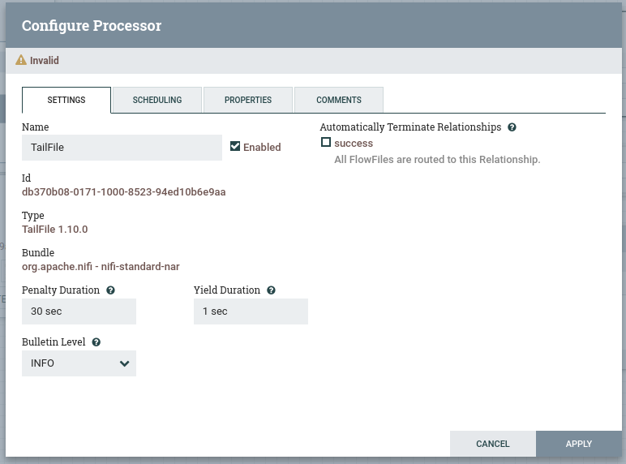  
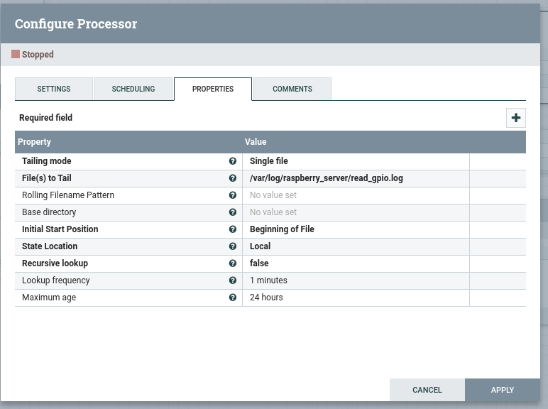  
点击`APPLY`后，再拖入一个`Remote Process Group (RPG)`  
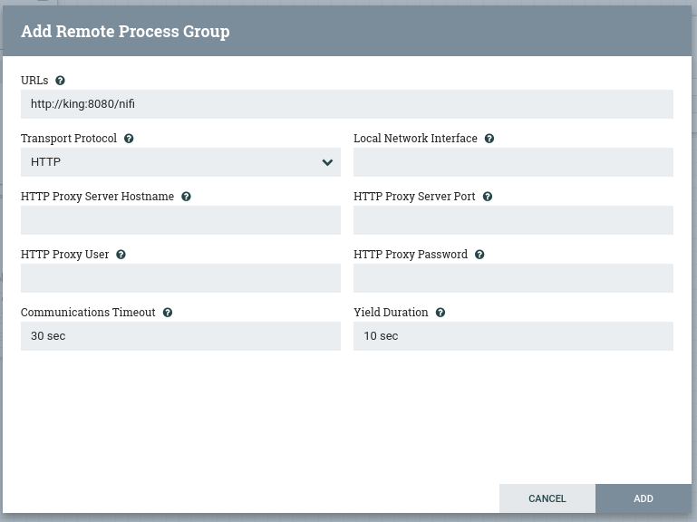    
完成组件拖入后，如下  
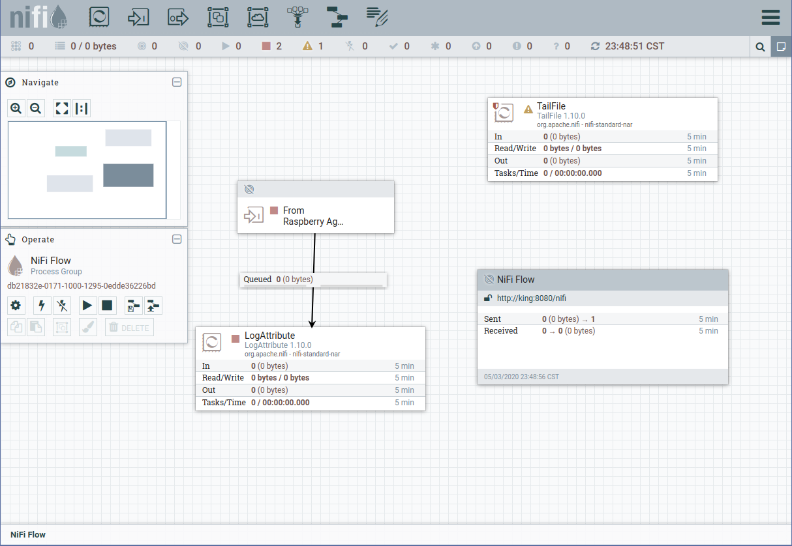  
同样，连接两个组件  
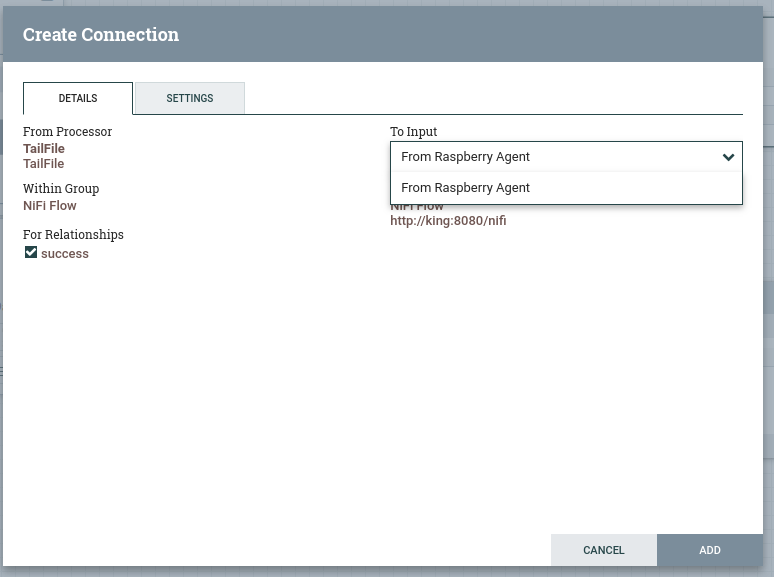  
`To Input` 选择之前创建的`From Raspberry Agent`,连接完成后整体流程如下：   
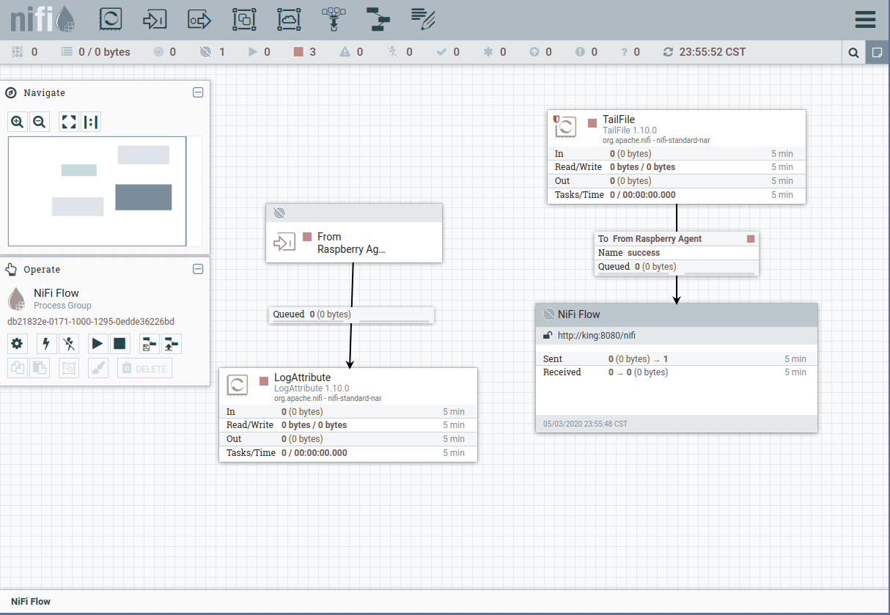    
> 需要注意的是，要确保没有黄色的感叹号

##### MiNiFi 数据流导出
在web界面，按住`shift`, 选择上图右侧的一排流程，并在组件上按住右键，选择 保存为模板   
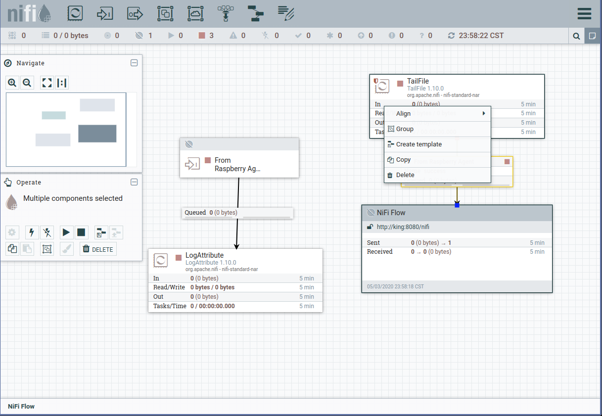   
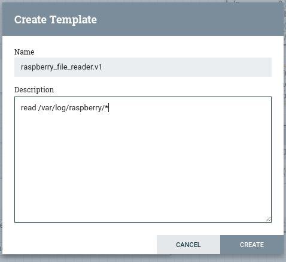   
点击web界面右上角的三条杠，选择`template`，下载刚配置的模板   
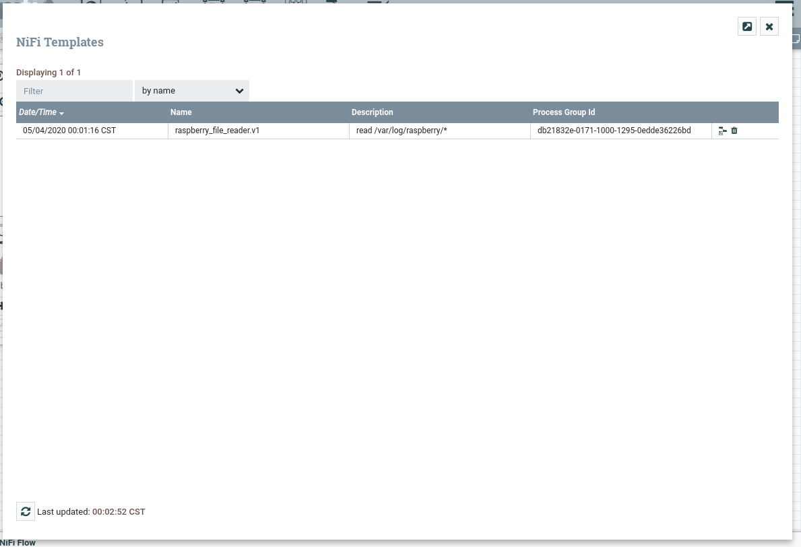   
下载的模板为xml，使用命令进行查看，并`scp`到Raspberry端
```shell script
cat ~/Downloads/raspberry_file_reader.v1.xml

# 确认无误后，将xml发送至Raspberry
scp ~/Downloads/raspberry_file_reader.v1.xml pi@raspberry-pi:/
```
> 由于生产环境上存在上千个这种客户端，所以统一更新使用`C2`服务进行，这里先做功能验证，稍后第二篇博文会进行详细描述

#### Raspberry端
下载MiNiFi(0.4.0) 、MiNiFi toolkit(0.0.1)与Java（1.8）
```shell script
cd /usr/local/apps
wget https://repo.huaweicloud.com/java/jdk/8u151-b12/jdk-8u151-linux-arm32-vfp-hflt.tar.gz
wget https://archive.apache.org/dist/nifi/minifi/0.4.0/minifi-0.4.0-bin.tar.gz
wget http://archive.apache.org/dist/nifi/minifi/0.0.1/minifi-toolkit-0.0.1-bin.tar.gz
tar -xzvf jdk-8u151-linux-arm32-vfp-hflt.tar.gz
tar -xzvf minifi-toolkit-0.0.1-bin.tar.gz
tar -xzvf minifi-0.4.0-bin.tar.gz
```
> Java 环境配置同 Ubuntu，这里不做重复内容

将导出的模板转换为yml
```shell script
cd /usr/local/apps/minifi-toolkit-0.0.1
bin/config.sh transform ~/raspberry_file_reader.v1.xml ../minifi-0.4.0/conf/config.yml

Java home: /usr/local/apps/jdk1.8.0_151
MiNiFi Toolkit home: /usr/local/apps/minifi-toolkit-0.0.1


No validation errors found in template.
```

调整yml
```shell script
cd /usr/local/apps/minifi-0.4.0
ls
bin  conf  docs  lib  LICENSE  NOTICE  README

vim conf/config.yml

# 在Remote Process Group (RPG) 的 Input Ports 添加 NiFi 服务端端口和地址
Remote Processing Groups:
- name: http://king:8080/nifi
  url: http://king:8080/nifi
  comment: ''
  timeout: 30 sec
  yield period: 10 sec
  Input Ports:
  - id: AUTOGENERATED_NIFI_PORT_ID_HERE
    name: MiNiFi-input
    comment: ''
    max concurrent tasks: 1
    use compression: false
    Properties: 
        Port: 10260      
        Host Name: king
```
> 不调整yml会出现异常如 `ERROR [Timer-Driven Process Thread-9] o.a.nifi.remote.StandardRemoteGroupPort RemoteGroupPort[name=From Raspberry Agent,targets=http://king:8080/nifi] failed to communicate with http://king:8080/nifi because the remote instance indicates that the port is not in a valid state`


#### 联调测试
在Raspberry创建日志文件
```shell script
cd /var/log
sudo mkdir raspberry_server
sudo chmod 777 raspberry_server
touch read_gpio.log
```

启动MiNiFi服务
```shell script
cd /usr/local/apps/minifi-0.4.0
bin/minifi.sh start

tail -f logs/minifi-app.log
```
> 此时会出现`the remote instance indicates that the port is not in a valid state`的异常，不用担心，启动NiFi流程后就恢复正常

启动NiFi流程    
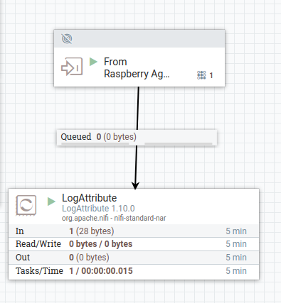  
> 同模板导出的步骤一样，按住`shift`，选择左侧的nifi的处理流程，并在组件上点击鼠标右键，选择启动，或左边的控制栏里进行启动   


服务端启动日志监测
```shell script
cd /usr/local/apps/nifi-1.10.0
tail -f logs/nifi-app.log

# 表示minifi连接上，如果启动了c2服务，该服务能看到连接的minifi的ip
2020-05-04 00:28:32,009 INFO [Site-to-Site Worker Thread-1] o.a.n.r.p.s.SocketFlowFileServerProtocol Sending list of 1 peers back to client Peer[url=nifi://pi:35682]
```

在Raspberry往日志文件写入内容进行测试
```shell script
cd /var/log/raspberry_server
echo '[20100-230-22][min.py] 15.3' >> read_gpio.log
```

服务段日志能够看到以下内容
```shell script
2020-05-04 00:40:27,541 INFO [Provenance Repository Rollover Thread-2] o.a.n.p.PersistentProvenanceRepository Successfully Rolled over Provenance Event file containing 205 records. In the past 5 minutes, 5 events have been written to the Provenance Repository, totaling 2.56 KB

2020-05-04 00:40:26,200 INFO [Timer-Driven Process Thread-1] o.a.n.processors.standard.LogAttribute LogAttribute[id=db2f5af8-0171-1000-5515-0b3f7fe924f9] logging for flow file StandardFlowFileRecord[uuid=c991b687-7340-4614-b9f1-e203be519009,claim=StandardContentClaim [resourceClaim=StandardResourceClaim[id=1588523810798-1, container=default, section=1], offset=28, length=28],offset=0,name=read_gpio.28-56.log,size=28]
```

在web页面上可看到数据流情况  
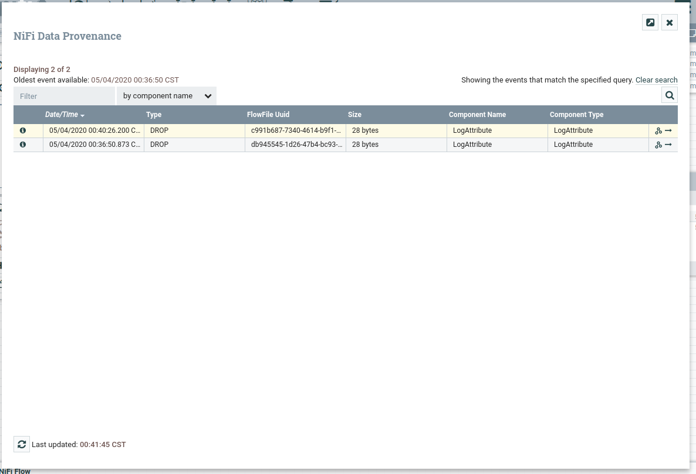   
> 选择中间的队列可以看到数据读取的情况

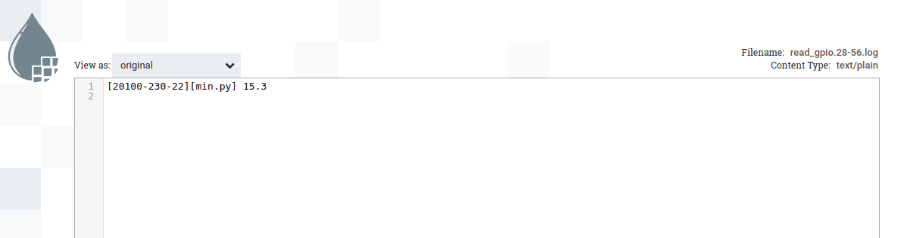   
> 选择第一条可以看到刚才在Raspberry输入的内容

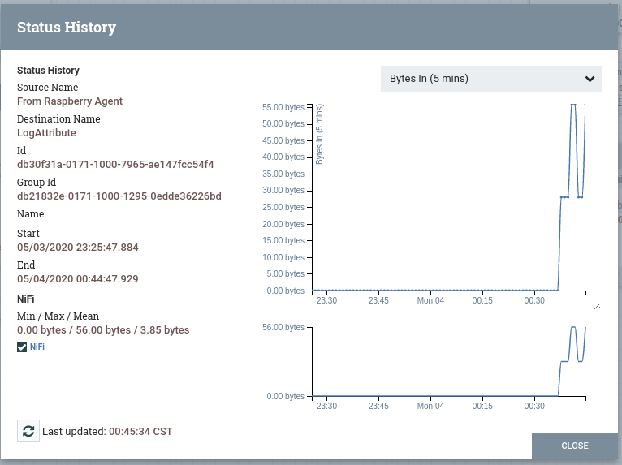   
> 还可以通过历史查看数据流情况

#### 异常
##### 出现`ERROR [Site-to-Site Worker Thread-***] Unable to communicate with remote instance Peer`
这种情况有些复杂，首先确保终端与服务端的网络情况，由于之前服务器有安装过`UFW（防火墙软件）`，导致终端无法连接到服务器；其次，由于之前的脏数据影响，导致一直连接错误的ip，需要将minifi的文件目录恢复成解压后的情况；
再有，就是判断nifi端的数据流是否启动，未启动流程，即数据没有消费的话也是会出现该问题。
