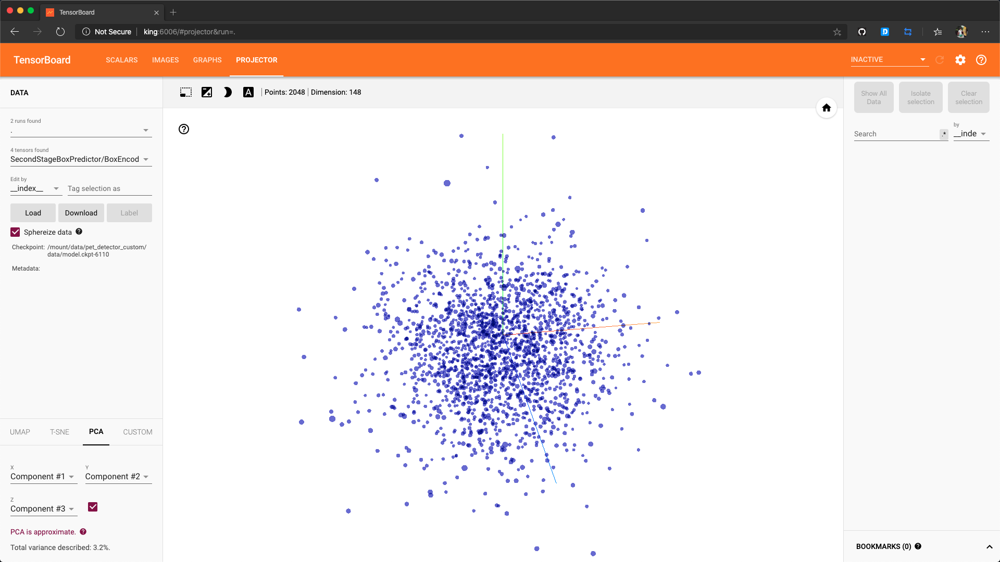
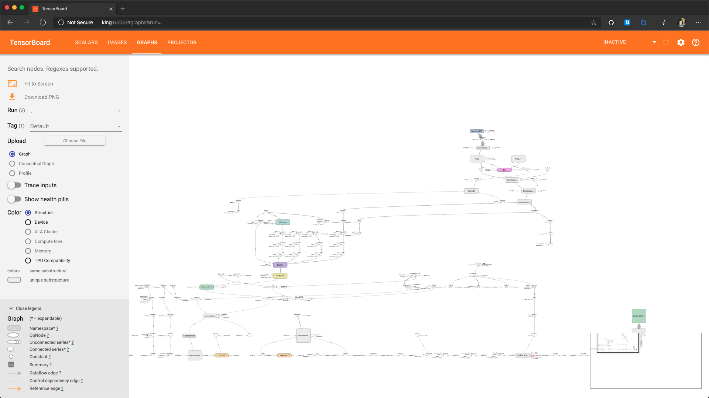
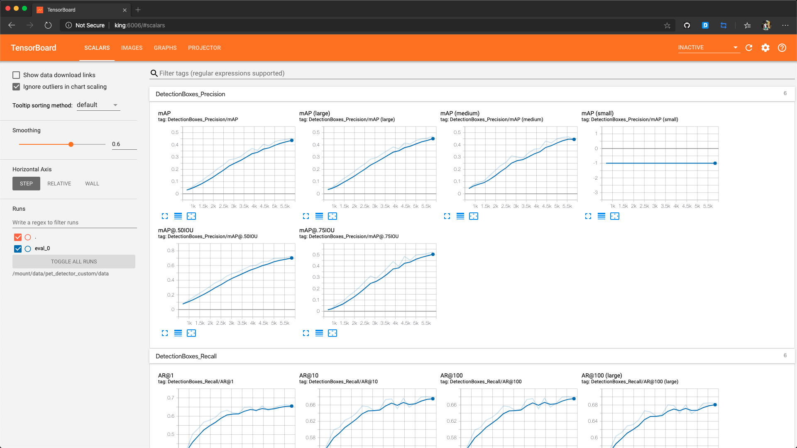
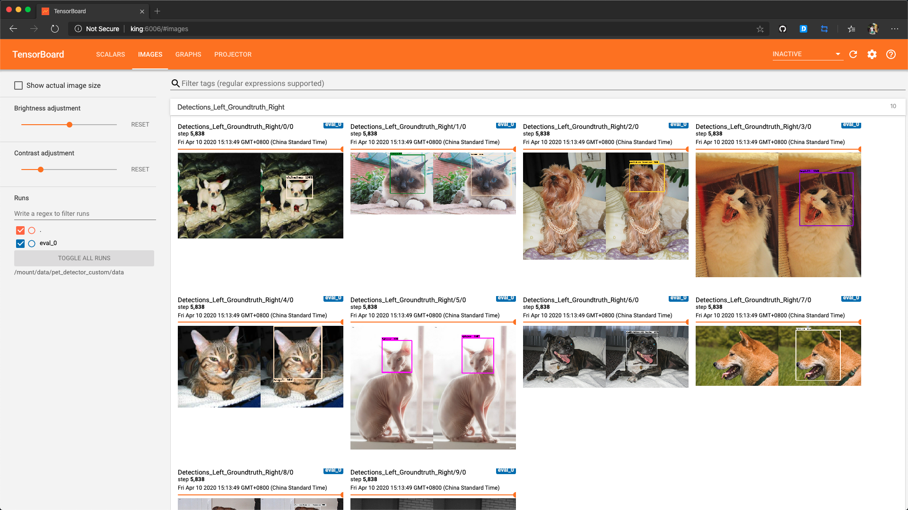

TensorFlow Object Detector API Run In Local
===

> create by [afterloe](605728727@qq.com)  
> version is 1.2.0  
> MIT License  

使用TensorFlow的对象检测API训练自己的SSD模型

#### 前提准备
* 已安装`TensorFlow` 或 `TensorFlow GPU`
* 已完成TensorFlow API的安装，若未完成，可[参考这里](./TensorFlow_API_Install_Guide.md)进行安装

#### 下载数据集
使用的是`Oxford-IIIT`的宠物数据库, 用于训练宠物识别
```shell script
cd /mount
mkdir pet_detector_custom
wget http://www.robots.ox.ac.uk/~vgg/data/pets/data/images.tar.gz
wget http://www.robots.ox.ac.uk/~vgg/data/pets/data/annotations.tar.gz
tar -xvf images.tar.gz
tar -xvf annotations.tar.gz
```

#### 数据类型转换
TensorFlow对象检测API期望数据采用TFRecord格式，因此运行`create_pet_tf_record.py`将原始的Oxford-IIIT Pet数据集转换为TFRecords。
```shell script
cd /home/afterloe/tensorflow_api/research
python3 object_detection/dataset_tools/create_pet_tf_record.py \
        --label_map_path=object_detection/data/pet_label_map.pbtxt \
        --data_dir=/mount/pet_detector_custom
        --output_dir=/mount/pet_detector_custom
```

#### 准备数据文件夹
```shell script
cd /mount/pet_detector_custom
mkdir data && cd data
mv ../annotations/* ./
mv ../images/pet_faces_train.record-* ./
mv ../images/pet_faces_val.record-* ./
cp /home/afterloe/tensorflow_api/research/object_detection/data/pet_label_map.pbtxt ./
```
准备完成后的文件目录如下
```
/mount/pet_detector_custom/data
    ├── pet_faces_train.record-00000-of-00010
    ├── pet_faces_train.record-00001-of-00010
    ├── pet_faces_train.record-00002-of-00010
    ├── pet_faces_train.record-00003-of-00010
    ├── pet_faces_train.record-00004-of-00010
    ├── pet_faces_train.record-00005-of-00010
    ├── pet_faces_train.record-00006-of-00010
    ├── pet_faces_train.record-00007-of-00010
    ├── pet_faces_train.record-00008-of-00010
    ├── pet_faces_train.record-00009-of-00010
    ├── pet_faces_val.record-00000-of-00010
    ├── pet_faces_val.record-00001-of-00010
    ├── pet_faces_val.record-00002-of-00010
    ├── pet_faces_val.record-00003-of-00010
    ├── pet_faces_val.record-00004-of-00010
    ├── pet_faces_val.record-00005-of-00010
    ├── pet_faces_val.record-00006-of-00010
    ├── pet_faces_val.record-00007-of-00010
    ├── pet_faces_val.record-00008-of-00010
    ├── pet_faces_val.record-00009-of-00010
    └── pet_label_map.pbtxt
```

#### 下载预处理的模型
从头开始训练对象检测器可能需要几天的时间，直接使用在COCO数据集上训练过的对象检测器，并重用其中的一些参数来初始化自己的新模型。 
下载带有Resnet-101模型的COCO预训练的`Faster R-CNN`。解压缩文件夹中的内容并将`model.ckpt*`文件复制到`/mount/pet_detector_custom/data`中。
```shell script
cd ~/Downloads/
wget http://storage.googleapis.com/download.tensorflow.org/models/object_detection/faster_rcnn_resnet101_coco_11_06_2017.tar.gz
tar -xvf faster_rcnn_resnet101_coco_11_06_2017.tar.gz
mv model.ckpt* /mount/pet_detector_custom/data
```

#### 配置对象检测管道文件
在TensorFlow对象检测API中，模型参数、训练参数和评估参数均由配置文件定义，更多详细信息可以在[这里](https://github.com/tensorflow/models/blob/master/research/object_detection/g3doc/configuring_jobs.md)找到。
使用源代码随附的一些预定义模板`object_detection/samples/configs`文件夹中，有最基础的object_detection配置文件。
使用`faster_rcnn_resnet101_pets.config`作为配置管道的基础文件并进行修改  
在文件中搜索`PATH_TO_BE_CONFIGURED`，并将其替换为适当的值，开始训练/评估/监控等工作时都将需要它。
```shell script
cd /mount/pet_detector_custom
cp /home/afterloe/tensorflow_api/research/object_detection/samples/configs/faster_rcnn_resnet101_pets.config ./
sed -i "s|PATH_TO_BE_CONFIGURED|"/mount/pet_detector_custom/data"|g" faster_rcnn_resnet101_pets.config
cat faster_rcnn_resnet101_pets.config

eval_input_reader: {
  tf_record_input_reader {
    input_path: "/mount/pet_detector_custom/data/pet_faces_val.record-?????-of-00010"
  }
  label_map_path: "/mount/pet_detector_custom/data/pet_label_map.pbtxt"
  shuffle: false
  num_readers: 1
}
```

#### 检查作业文件完整度

作业目录
```
/mount/pet_detector_custom
├── data
└── faster_rcnn_resnet101_pets.config
```

数据目录
```
/mount/pet_detector_custom/data
    ├── model.ckpt.index
    ├── model.ckpt.meta
    ├── model.ckpt.data-00000-of-00001
    ├── pet_label_map.pbtxt
    ├── pet_faces_train.record-*
    └── pet_faces_val.record-*
```

#### 编写运行脚本
```shell script
cd /mount/pet_detector_custom
touch run.sh
chmod +x run.sh

#!/bin/bash

PIPELINE_CONFIG_PATH=`pwd`/faster_rcnn_resnet101_pets.config
MODEL_DIR=`pwd`/data
NUM_TRAIN_STEPS=50000
SAMPLE_1_OF_N_EVAL_EXAMPLES=1
API_HOME=/home/afterloe/object_detector_api/research


cd ${API_HOME}
python3 object_detection/model_main.py \
	--pipeline_config_path=${PIPELINE_CONFIG_PATH} \
	--model_dir=${MODEL_DIR} \
	--num_train_steps=${NUM_TRAIN_STEPS} \
	--sample_1_of_n_eval_examples=${SAMPLE_1_OF_N_EVAL_EXAMPLES} \
	--alsologtostderr

cd ${HOME}
```

#### 运行并监测执行情况
启动作业
```shell script
cd /mount/pet_detector_custom
. run.sh
```

监控作业进度情况
```shell script
cd ~/.local/bin
MODEL_DIR=/mount/pet_detector_custom/data
tensorboard --logdir=${MODEL_DIR}

host is run in 127.0.0:6006 ...
```
> 确保TensorBoard版本与TensorFlow（1.15.2）相同的版本  

经过大约一个半小时的培训(GPU 可以半小时)，可以看到以下内容：



