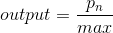
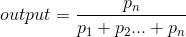

# 图像处理相关操作
> create by [afterloe](605728727@qq.com)  
> version 1.2  
> MIT License  

本节内容包括
```
   - 图像归一化操作
   - 视频及摄像头内容读取与分片存储
   - 图像翻转、缩放（插值计算）、绘图
   - ROI区域提取（规则、非规则）、图像直方图
   - 直方图均衡化（图像增强）、相似度对比（直方图比较）
   - HSV 色系取值范围
   - 直方图反向投影（图像ROI目标检索）
```
> ps:由于篇幅原因，<a href="#hsv">HSV 色系取值范围</a>点导航直达

## 图像归一化
图像归一化处理的作用 主要是把各种处理好的数据转换为图像并正常显示或把图像转换为数据进行各种处理
归一化处理前 需要将数据转换为 float类型，避免出错 归一化的四种算法分别如下，详细的描述可以点击链接查看
<a href="#minmax">MIN_MAX的算法</a>  
<a href="#inf">INF的算法</a>  
<a href="#l2">L2的算法</a>  
<a href="#l1">L1的算法</a>   
其api描述为
```
cv.normalize(gray, alpha, beta, norm_type)
    - gray: 输入参数，灰度图像
    - alpha: 图像中最小值
    - beta: 图像中的最大值
```
使用的不同的api，alpha均有用，而beta在`NORM_MINMAX`中有用， 具体用法可参考[这里](./1-clazz.py)    


## 附件
各算法的描述如下
### <a id="minmax">MIN_MAX的算法</a>
假设输入图像像素点位 `[2.0, 8.0, 10.0]`  
转换过程：   
根据 delta进行  


delta = 10.0 - 2.0 = 8.0

input | process | output
-|-|-
2.0 | (2.0 - 2.0) / 8.0 | 0
8.0 | (8.0 - 2.0) / 8.0 | 0.75
10.0 | (10.0 - 2.0) / 8.0 | 1.0

### <a id="inf">INF的算法</a> 
输入图像像素点位同上即`[2.0, 8.0, 10.0]`   
转换过程：   
根据最大值进行  


delta = 10.0

input | process | output
-|-|-
2.0 | 2.0 / 10.0 | 0.2
8.0 | 8.0 / 10.0 | 0.8
10.0 | 10.0 / 10.0 | 1.0

### <a id="l2">L2的算法</a> 
输入图像像素点位同上即`[2.0, 8.0, 10.0]`   
转换过程：   
根据平方向量  


delta = 根号168  (约等于12.9614)

input | process | output
-|-|-
2.0 | 2.0 / 12.9614 | 0.15
8.0 | 8.0 / 12.9614 | 0.62
10.0 | 10.0 / 12.9614 | 0.77

### <a id="l1">L1的算法</a>   
输入图像像素点位同上即`[2.0, 8.0, 10.0]`   
转换过程：   
根据像素点之和取模  


delta = 2 + 8 + 10 = 20.0

input | process | output
-|-|-
2.0 | 2.0 / 20.0 | 0.1
8.0 | 8.0 / 20.0 | 0.4
10.0 | 10.0 / 20.0 | 0.5


## <a id="hsv">HSV颜色空间转换</a>
Opencv中常用的颜色转换为两种，BGR -> Gray, BGR -> HSV；其中Gray与HSV不可以相互转换，HSV颜色空间的取值范围
```
H [0, 180]
S [0, 255]
V [0, 255]
```

常用颜色的HSV取值范围

取值 | 黑 | 灰 | 白 | 红 | 橙 | 黄 | 绿 | 青 | 蓝 | 紫
-|-|-|-|-|-|-|-|-|-|-
hmin | 0 | 0 | 0 | 0[156] | 11 | 26 | 35 | 78 | 100 | 125
hmax | 180 | 180 | 180 | 10[180] | 25 | 34 | 77 | 99 | 124 | 155
smin | 0 | 0 | 0 | 43 | 43 | 43 | 43 | 43 | 43 | 43
smax | 255 | 43 | 30 | 255 | 255 | 255 | 255 | 255 | 255 | 255
vmin | 0 | 46 | 221 | 46 | 46 | 46 | 46 | 46 | 46 | 46
vmax | 46 | 220 | 255 | 255 | 255 | 255 | 255 | 255 | 255 | 255


